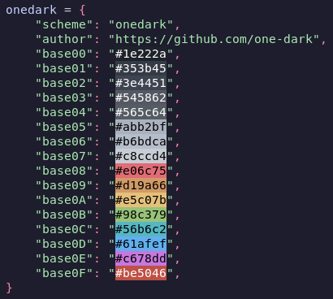
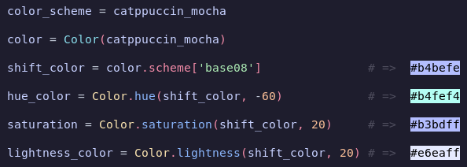

# BASE16_COLORLIB

## COLOR SCHEME:

### Package contains several ready-made color schemes in `base16` format:
<br/>




<details>
  <summary>Each color scheme is a dictionary with a common structure:</summary>
    <br>

  ```python
  {
    "scheme": "onedark",
    "author": "https://github.com/one-dark",
    "base00": "#1e222a",
    "base01": "#353b45",
    "base02": "#3e4451",
    "base03": "#545862",
    "base04": "#565c64",
    "base05": "#abb2bf",
    "base06": "#b6bdca",
    "base07": "#c8ccd4",
    "base08": "#e06c75",
    "base09": "#d19a66",
    "base0A": "#e5c07b",
    "base0B": "#98c379",
    "base0C": "#56b6c2",s
    "base0D": "#61afef",
    "base0E": "#c678dd",
    "base0F": "#be5046",
}
  ```
</details>

<br/>
Color schemes adhere to all colors that are declared by the authors,
however, they may differ slightly, including in the order of colors.

<br/>

[Styling Guidelines:](https://github.com/chriskempson/base16/blob/main/styling.md)

- base00 - Default Background
- base01 - Lighter Background (Used for status bars, line number and folding marks)
- base02 - Selection Background
- base03 - Comments, Invisibles, Line Highlighting
- base04 - Dark Foreground (Used for status bars)
- base05 - Default Foreground, Caret, Delimiters, Operators
- base06 - Light Foreground (Not often used)
- base07 - Light Background (Not often used)
- base08 - Variables, XML Tags, Markup Link Text, Markup Lists, Diff Deleted
- base09 - Integers, Boolean, Constants, XML Attributes, Markup Link Url
- base0A - Classes, Markup Bold, Search Text Background
- base0B - Strings, Inherited Class, Markup Code, Diff Inserted
- base0C - Support, Regular Expressions, Escape Characters, Markup Quotes
- base0D - Functions, Methods, Attribute IDs, Headings
- base0E - Keywords, Storage, Selector, Markup Italic, Diff Changed
- base0F - Deprecated, Opening/Closing Embedded Language Tags

<br>

>Of course, the color scheme can also be used as a theme, for example, I use this for colorize [Qtile](http://www.qtile.org/)

<br>

## COLOR CLASS:

Package contains class `Color` which can be a container for a color scheme
and has public methods for changing colors according to the HSL color model:

<br/>



This class is intended to be stored in an attribute `Color.scheme` color scheme in base16 format.\
And its subsequent use to set the color for various elements.\
Since there are only 16 colors in base16,
sometimes this is not enough to place color accents anywhere.\
Therefore, the class has several methods for adjusting the color.
> The HSL color model is used here.
> 
>HLS:
>> Hue\
>>Luminance\
>>Saturation
> - H: position in the spectrum
> - S: color saturation
> - L: color lightness
> 
>You are probably familiar with it, if not, it's best to just see how
>you can change the color by changing one of the parameters,
>for example here: [hslpicker](https://hslpicker.com/)


Each channel has its own method which accepts a color and a ratio offsets:


- Color.hue(color, shift)
- Color saturation(color, shift)
- Color.lightness(color, shift)


For saturation, lightness, the shift argument\
takes the offset percentage relative to the current color (-100, 100).\
If you pass a percentage that will go beyond frame,\
then the parameter being changed will take the maximum or minimum possible value.\
For hue, the absolute value of the degree that H can
be changed this channel (-360, 360).

<br>


## USAGE EXAMPLE :

- Import the color scheme and access colors like normal dictionary keys:
  ```python
    from base16_colorlib import onedark  # or something else: catppuccin_mocha, etc


    color_scheme = onedark
    red = color_scheme['base08']
    green = color_scheme['base0B']
  ````
- Usage along with color class:
  ```python
    from base16_colorlib import Color
    from base16_colorlib import onedark


    color = Color(**onedark)
    
    red = color.scheme['base08']
    green = color.scheme['base0B']

    hue_red = color.hue(red, 20)
    saturation_red = color.saturation(red, -30)
    lightness_red = color.lightness(red, 42)
  ````
- From my qtile config:
  ```python
    #...
    from base16_colorlib import Color
    from base16_colorlib import catppuccin_mocha
    #...

    colors = Color(**catppuccin_mocha)

    #...
    widgets = {
        #...
        'Timelabel': widget.TextBox(
            background=colors.lightness(colors.scheme['base0D'], -4),  # <= look this
            foreground=colors.scheme['base00'],
            font=font.FAMILY,
            fontsize=font.SIZE_WIDGETS,
            padding=None,
            text=' 󰥔 ',  # nf-md-clock
        ),
        'Time': widget.Clock(
            background=colors.scheme['base0D'],  # <= look this
            foreground=colors.scheme['base00'],
            font=font.FAMILY,
            fontsize=font.SIZE_WIDGETS,
            fmt='{}',
            format='%H:%M %a',
            markup=True,
            max_chars=0,
            mouse_callbacks={},
            padding=None,
            timezone=None,
            update_interval=1.0,
        ),
        #...
    }
  ````
## Result:


# License:

GPLv3